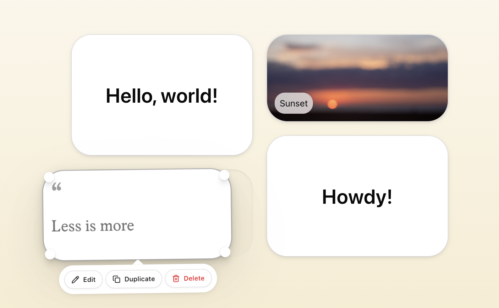

# dnd-grid

A drag-and-drop, resizable grid layout for React

<p>
  <a href="https://www.npmjs.com/package/@dnd-grid/react"></a>
  <a href="LICENSE.md"></a>
</p>

<p align="center">
  <a href="https://dnd-grid.com">
    
  </a>
</p>

## Demo

Try the live demo.

<p>
<a href="https://dnd-grid.com">

</a>
</p>

## Installation

```bash
npm install @dnd-grid/react
```

Add the styles to your global CSS:

```css
@import "@dnd-grid/react/styles.css";
```

## Usage

```tsx
import { DndGrid, type Layout } from "@dnd-grid/react";

<DndGrid layout={layout} cols={12} rowHeight={50} onLayoutChange={setLayout}>
  {layout.map((item) => (
    <div key={item.id}>{item.id}</div>
  ))}
</DndGrid>;
```

## Documentation

To learn how to get started with **dnd-grid**, visit the official documentation website for API docs, guides, and examples.

<p>
<a href="https://dnd-grid.com/docs">

</a>
</p>

## Licence

[MIT](LICENSE.md)
